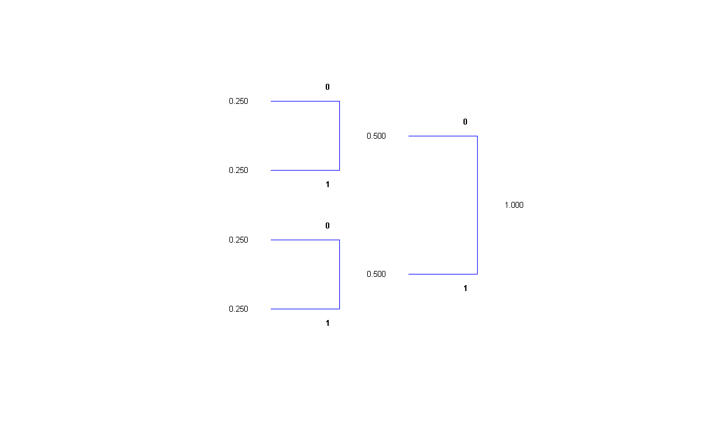
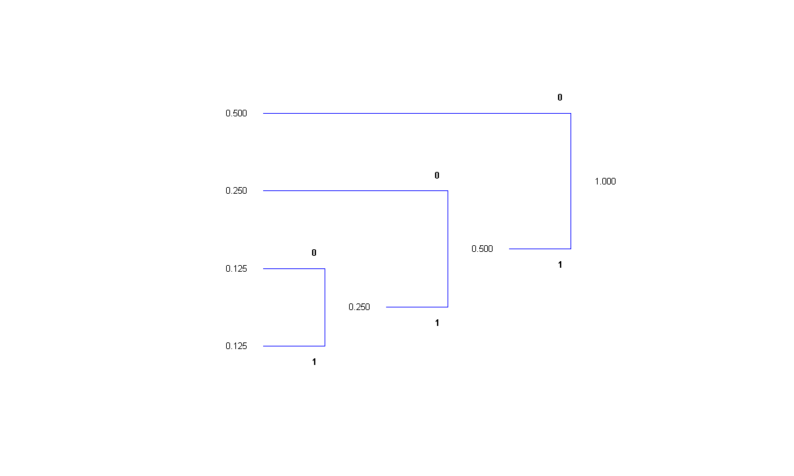

#Huffman Tree Visualiser

##Description
This is a simple tool to help visualise Huffman code implementations. It lists the input probabilities and 
draws the corresponding tree diagram that dictates the Huffman code.

##Usage
```
Usage: huffmantree(p)

Options:
	p	List of probabilities for each alphabet element

```

##Examples
```
p = [0.25, 0.25, 0.25, 0.25];
huffmantree(p)
```



```
p = [0.125, 0.125, 0.25, 0.5];
huffmantree(p)
```


